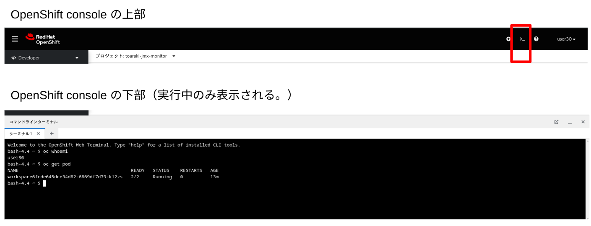

# ハンズオンシナリオで使用するツール

## Terminal Console
OpenShift Console から、コマンド実行用のコンテナをダイナミックに払い出して操作を行うことができます。

Web UI からの操作結果や、oc コマンドやkubectlを用いた操作、環境や状態の操作等、即座に行いたい場合には便利です。ただし、コンテナとなるため、script コマンド等、操作ログを記録するのには不向きです。

なお、ターミナルPODを起動するためには、ログインしているアカウントが操作可能なProject ( namespace ) が最低一つ必要となるので、予めProject を作成してから利用してください。

## ROSA CLI
[Red Hat Hybrid Cloud Console](https://console.redhat.com) から入手可能な、ROSAを操作するためのコマンドラインツール。クラスターの作成や、ログインアカウントへの権限管理を行うことができる。
このハンズオンでは、bastionマシン上に、クレデンシャル情報を含めてセットアップされています。

