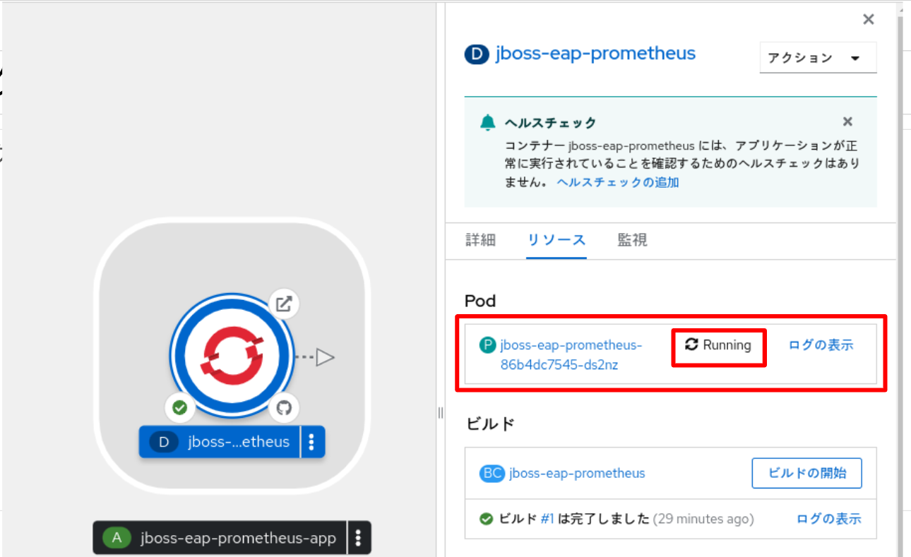

ifdef::env-github[]
:tip-caption: :bulb:
:note-caption: :information_source:
:important-caption: :heavy_exclamation_mark:
:caution-caption: :fire:
:warning-caption: :warning:
endif::[]

= Lab 1-3: Prometheus JMX Exporterの展開

1-3 〜 1-5 のシナリオでは、アプリケーションのモニタリングデータを詳細に収集する一つの方法を体験します。OpenShift 以外のkuberntes デストロ環境でも度々採用されるPrometheusに、JavaアプリケーションのJMXからデータを取得し、可視化するまでのセットアップを行います。
通常、Prometheus のセットアップは、複雑な操作を伴いますが、OpenShift では、Operator を利用することで、省力的に専用の監視基盤を構築することができます。( 主に、Lab 1-4 、1-5 で扱います。)

== 1-3-1. Labで扱うアプリケーション構成

このLab 1-3では、監視対象となるJBoss EAPのJavaアプリケーションをデプロイした後、PrometheusのJMX(Java Management Extensions) Exporterを使ってこのアプリケーションのメトリクスデータを公開します。 +
後続するLab 1-4, 1-5で、Prometheus OperatorでPrometheusをデプロイし、JMXメトリクスデータを可視化します。 +

=== JMX Exporterは2つの動作を提供します。

- Java Agent +
Java Agent 用 JAR ファイルからメトリクスを収集 +
- HTTP server +
リモートの JMX ターゲットからメトリクスを取得しHTTPで公開

== 1-3-2. 監視対象となるJavaアプリケーションのデプロイ

=== OpenShiftコンソールへのログイン

ブラウザ(Chrome or Firefox)でOpenShift Webコンソールにログインします。

OpenShift WebコンソールのRULは、etherpad OpenShift WebコンソールのURLを参照ください。

////
`userX` としてログインしましょう。パスワードはetherpadの OpenShiftユーザのパスワードを参照ください。
(etherpadで予約したuser1,user2などのIDです)

Webコンソールの基本操作やクラスター内コンポーネントの基本的な動作の確認を行いたい場合は、前のハンズオンlink:ocp4ws-ops-1-1.adoc[OpenShiftクラスターへのログインと動作確認(Lab1-1)]を実施してください。
////

=== Javaアプリケーションのビルド

==== 1. Project作成

//// 
 
////
監視アプリケーション用の"<LOGIN USER NAME>-jmx-monitor"という名前のProjectを作ります。 +

画面上部のプロジェクトドロップダウンリスとを展開し、プロジェクトの作成ボタンを押下します。

image::images/ocp4ws-ops/lab1-3-001.png[]

名前フィールドに、プロジェクト名（例："<LOGIN USER NAME>-jmx-monitor"）を入力し、作成ボタンを押下します。

NOTE: 以降の作業は全て"<LOGIN USER NAME>-jmx-monitor"Projectで行います。 +

image::images/ocp4ws-ops/lab1-3-004.png[]

=== Javaアプリケーションのデプロイ

==== 1. Javaアプリケーションのコンテナビルドと展開

"＋追加"メニューを選択し、追加の方法として、”Git リポジトリー" を選択します。

Git リポジトリーURLフィールドに、取得元となるURLとして``https://github.com/openlab-red/jboss-eap-prometheus``を入力します。

image::images/ocp4ws-ops/lab1-3-006.png[]

指定された取得されたデータにもとづき、画面の表示が変わるので、"作成"ボタンを押下します。

image::images/ocp4ws-ops/lab1-3-007.png[]

画面が、トポロジービューに切り替わります。各種リソースの作成、コンテナイメージのビルド、アプリケーションの実行が逐次実行されます。Deploymentを示すアイコンをクリックすると、画面右側に詳細情報を表示する画面が展開されます。ここから、タスクの状況や作成されたリソースを確認することができます。

image::images/ocp4ws-ops/lab1-3-008.png[]

Deploymentの処理が無事に完了すると、Pod がRunning ステータスとなります。

初期状態のアプリケーションのデプロイはここまでで完了です。

==== 2. Deploymentへ追加設定

Prometheus に対し、JMX のデータを提供できるように追加の設定を行います。

Runningステータスとなったことが確認できたら、右上”アクション”ドロップダウンリストより、Deploymentの編集を選びます。

image::images/ocp4ws-ops/lab1-3-011.png[]

Deployment のフォームビューにて画面をスクロールし、下方の”環境変数セクション”を表示します。

各フィールドにそれぞれ下記の様に入力します。

|===
|名前|値

|PREPEND_JAVA_OPTS
|"-javaagent:/opt/eap/prometheus/jmx-prometheus.jar=9404:/opt/eap/prometheus/config.yaml"
|===

NOTE: javaの起動パラメータとして、jarファイルと設定ファイルを指定しています。これらのファイルは、入手元のgitリポジトリに配置されていたもので、コンテナをビルドする際に、コンテナ内に配置されたものとなります。 +

入力が完了したら、画面下部の"保存"ボタンを押下します。

PODの入れ替えが完了するまで待ちます。（通常、数秒で完了します）

==== 3. サービスの追加
ここまでの操作によって、コンテナが提供する通常の8080ポートに紐付く機能に加え、9404ポートでJMXの情報参照用のサービスが有効になりました。
続く操作では。OpenShift 内部で、他PODから参照できるように、サービスを作成します。

PODが再び、Runningステータスとなったら、リソースタブ内のサービス欄にある、"jboss-eap-prometheus" リンクをクリックします。

image::images/ocp4ws-ops/lab1-3-015.png[]

サービスの詳細画面が表示されるので、YAMLタブをクリックします。

YAML定義のspec.ports セクションを特定し、下記のように編集します。

* 編集前
[source]
----
...
  ports:
    - name: 8080-tcp
      protocol: TCP
      port: 8080
      targetPort: 8080
...
----

* 編集後
[source]
----
...
  ports:
    - name: 8080-tcp
      protocol: TCP
      port: 8080
      targetPort: 8080
    - name: 9404-tcp
      protocol: TCP
      port: 9404
      targetPort: 9404
...
----

編集が完了したら、"保存"ボタンをクリックします。

正常に更新が完了すると、[jboss-eap-prometheusがバージョンXXXXXに更新されました。]とメッセージが表示されます。メッセージを確認できたら、トポロジーメニューを選択します。

Deploymentの詳細情報にあるリソースタブ内のサービスエントリーとして、9404ポートが追加されていることを確認します。

==== 4. JMX(9404)ポートの公開（routeの作成）
作成したサービスを外部へ公開します。

NOTE: この操作は、本来、OpenShiftの外部からアクセスするための操作となるため、アクセスがOpenShift 内部で完結する場合は不要の操作となります。今回は、確認の便宜上、行っています。

Administratorパースペクティブに画面を切り替えます。

image::images/ocp4ws-ops/lab1-3-020.png[]

ネットワークメニューより、ルートを選択します。

image::images/ocp4ws-ops/lab1-3-021.png[]

画面右上の"ルートの作成"ボタンを押下します。

各種フィールドに、下記の情報を入力または、選択します。

|===
|フィールド名|値

|名前
|tcp-9404
|サービス
|jboss-eap-prometheus
|ターゲットポート
|9404→9404(TCP)
|===

image::images/ocp4ws-ops/lab1-3-023.png[]

入力が完了したら、"作成"をボタンクリックします。

image::images/ocp4ws-ops/lab1-3-024.png[]

画面上部の”ルート”（親メニュー）をクリックします。

image::images/ocp4ws-ops/lab1-3-025.png[]

作成されたルートの一覧が表示されます。

image::images/ocp4ws-ops/lab1-3-026.png[]

==== 5. アクセス確認
ルートとして公開されているリンクをたどり、アプリケーション本体および、JMXポートが正常に稼働しているか確認します。

image::images/ocp4ws-ops/lab1-3-026.png[]

jboss-eap-prometheus の場所フィールドのリンクをたどると、アプリケーション本体へアクセスすることが出来ます。

tcp-9404 の場所フィールドのリンクをたどると、JMXの応答データが表示されます。

image::images/ocp4ws-ops/lab1-3-028.png[]

これで、JMX Exporterの設定は完了です。 +
