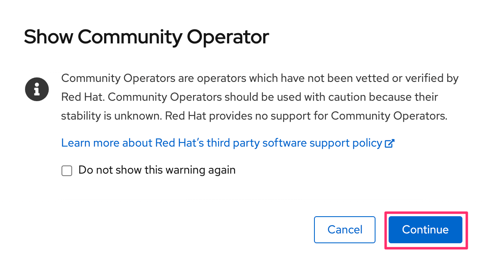

ifdef::env-github[]
:tip-caption: :bulb:
:note-caption: :information_source:
:important-caption: :heavy_exclamation_mark:
:caution-caption: :fire:
:warning-caption: :warning:
endif::[]

= Lab1-4: Prometheus Operatorの展開

== 1-4-1. Labで扱うOperator

=== Prometheus Operatorについて

Prometheus Operatorは、Kubernetesサービスの簡単な監視定義、およびPrometheusインスタンスの展開と管理を提供します。  +
Prometheus Operatorは次の機能を提供します。

* 容易なPrometheusの作成/破棄：Kubernetes名前空間、特定のアプリケーション、またはチーム用のPrometheusインスタンスをOperatorを使って簡単に起動できます。
* シンプルな設定：CRDを通してPrometheusのバージョン、永続性、保存ポリシー、レプリカなどの基本設定ができます。
* ラベルを介したターゲット：Kubernetesラベルクエリに基づいて、監視ターゲット構成を自動的に生成します。そのため、Prometheus固有の言語を学ぶ必要がありません。

=== 事前準備

* 事前にJMX Exporterを用意しておく。( Lab 1-3 )

== 1-4-2. ログインアカウントへcluster-admin権限の付与

このシナリオを実行するために、OpenShift ログインアカウントに対し、cluster-admin権限を付与します。

NOTE: OpenShiftを利用者として使用する場合は、cluster-admin権限は付与しないのが一般的です。ここでは、ハンズオンシナリオの便宜上付与する手段をとっていますが、必ずしも望ましい対応ではないという点にご注意ください。一方でどの範囲で付与するのが適切であるかは、組織のプロセスや運用体制、OpenShiftの利用形態等と、管理者権限による操作に許容されるリードタイムとリスクのバランス等、様々な要素を考慮して決定すべき事項となります。

=== Bastionマシンから、rosaコマンドの実行

NOTE: ROSAの場合、権限付与の操作は、rosa cli から行うことが可能です。

terminalソフトウェアや、sshコマンドで、Bastionマシンへログインします。接続に必要な情報は、Eterpad からご確認ください。

[source,bash,role="execute"]
----
[testuser30@ip-10-0-93-181 ~]$ rosa grant user cluster-admin --user <LOGIN USER NAME> --cluster 'rosa-qsfpw'
I: Granted role 'cluster-admins' to user 'XXXXXXXXX' on cluster 'rosa-qsfpw'
[testuser30@ip-10-0-93-181 ~]$
----

コマンドの実行が完了したら、OpenShift Console ( Web コンソール）を再ログインしてください。

== 1-4-3. Prometheus Operatorの展開

=== Project作成
``oc project``コマンドを使用して、現在指定されているProjectがJMX Exporterをデプロイした"userX-jmx-monitor"であることを確認してください。 +

[source,bash,role="execute"]
----
$ oc project
Using project "user1-jmx-monitor" on server "https://api.cluster-8a39.8a39.sandbox135.opentlc.com:6443".
----

=== Prometheus Operatorのインストール

==== 1. Prometheus Operatorの検索
OpenShift Webコンソールにログインし、[Administrator]パースペクティブから[Operators]>[OperatorHub]を指定し"Prometheus"を検索します。 +
この際、Projectが**"userX-jmx-monitor"**であることを確認しておきましょう。

==== 2. Operatorの設定
OperatorHubの中から、Prometheus Operator(Community)を選択して、[Install]を行います。 +

NOTE: コミュニティ版を利用すると、警告が表示されますが、一旦[Continue]で続けます。 +

"Install Operator"の画面では、以下の設定を指定して**Install**をクリックします。 +
[cols="2", options="header"]
|===
|Objects
|Selection

|Update Channel
|beta

|Installation Mode
|A specific namespace on the cluster

|Installed Namespace
|userX-jmx-monitor

|Approval Strategy
|Automatic
|===

実際のGUI上では以下のように設定します。 +

image::images/ocp4ws-ops/create-subscription.png[]

正しく設定されると、[View Operator]からPrometheus Operatorが確認できます。また、下図のように[Operators]>[Installed Operators]からでも辿ることができます。

image::images/ocp4ws-ops/prometheus-operator-overview.png[]

これで、Prometheus Operatorがインストールされました。 +
なおこの時点では、Custom Resource Definition(CRD)の登録やPrometheus Operatorの配置が行われるだけで、Prometheusのプロセス自体はまだ構築されません。 +

==== 3. Operator Managerによる管理
Operatorの管理に関して``oc``コマンドで確認します。 +
``oc describe``を使うことでWebコンソールのOperatorHubでは表示されないような、各Operatorの詳細な情報を得ることができます。 +
[source,bash,role="execute"]
----
$ oc describe packagemanifest prometheus -n openshift-marketplace
----

例えば、Installation Modeに注目してみると、Webコンソールでは、 +

* All namespaces on the cluster 
* A specific namespace on the cluster

の2つが表示されていました。一方、`oc describe` の出力では、次のような表示を見つけることができます。 +

----
      Install Modes:
        Supported:  true
        Type:       OwnNamespace
        Supported:  true
        Type:       SingleNamespace
        Supported:  false
        Type:       MultiNamespace
        Supported:  false
        Type:       AllNamespaces
----

これらのInstall Modeは下表のような特徴があります。Operator Managerによって内部的にはOperatorが監視するNamespacesの範囲を制御していることがわかります。 +

|===
| InstallMode | Action

| OwnNamespace
| Operatorは、独自のnamespace を選択するOperatorGroupのメンバーにできます。

| SingleNamespace
| Operatorは1つのnamespace を選択するOperatorGroupのメンバーにできます。

| MultiNamespace
| Operatorは複数の namespace を選択するOperatorGroupのメンバーにできます。

| AllNamespaces
| Operatorはすべての namespace を選択するOperatorGroupのメンバーできます (ターゲット namespace 設定は空の文字列 "" です)。
|===

==== 4. CRDの確認
Prometheus Operatorをインストールすると、CRD(Custom Resource Definition)が作成されます。 +
Webコンソールでは [Operators]>[Installed Operators]>[Prometheus Operator] から、デプロイされたPromethus OperatorのCRDが確認できます。 +

image::images/ocp4ws-ops/prometheus-operator-overview.png[Prometheus Catalog]

もちろんCRDは``oc``コマンドでも確認できます。``oc get crd``を実行すると作成されているCRDが表示されます。 +

[source,bash,role="execute"]
----
$ oc get crd --show-labels -l operators.coreos.com/prometheus.${TUTORIAL_MONITOR_NAMESPACE}
NAME                                        CREATED AT             LABELS
alertmanagerconfigs.monitoring.coreos.com   2022-03-17T03:17:16Z   operators.coreos.com/prometheus.jmx-monitor=
alertmanagers.monitoring.coreos.com         2022-03-17T03:17:19Z   operators.coreos.com/prometheus.jmx-monitor=
podmonitors.monitoring.coreos.com           2022-03-17T03:17:21Z   operators.coreos.com/prometheus.jmx-monitor=
probes.monitoring.coreos.com                2022-03-17T03:17:23Z   operators.coreos.com/prometheus.jmx-monitor=
prometheuses.monitoring.coreos.com          2022-03-17T03:17:26Z   operators.coreos.com/prometheus.jmx-monitor=
prometheusrules.monitoring.coreos.com       2022-03-17T03:17:28Z   operators.coreos.com/prometheus.jmx-monitor=
servicemonitors.monitoring.coreos.com       2022-03-17T03:17:30Z   operators.coreos.com/prometheus.jmx-monitor=
thanosrulers.monitoring.coreos.com          2022-03-17T03:17:33Z   operators.coreos.com/prometheus.jmx-monitor=
----

==== 5. Operator Installの確認
Operator自身もアプリケーションに他なりません。そのため、インストールされるPodとして稼働します。 +
``oc get pod``によって、Prometheus OperatorのPodがOLM(Operator Lifecycle Manager)によって配置されていることが確認できます。 +
[source,bash,role="execute"]
----
$ oc get pod -l k8s-app=prometheus-operator
NAME                                  READY   STATUS    RESTARTS   AGE
prometheus-operator-bd98985fd-vcnw6   1/1     Running   0          5m52s
----

'''

== 1-4-4. ログインアカウントからcluster-admin権限の削除
NOTE: ここまでの操作が完了したら、必ず行ってください。
NOTE: ROSAの場合、権限付与の操作は、rosa cli から行うことが可能です。

terminalソフトウェアや、sshコマンドで、Bastionマシンへログインします。接続に必要な情報は、Eterpad からご確認ください。

[source,bash,role="execute"]
----
[testuser30@ip-10-0-93-181 ~]$ rosa revoke user cluster-admin --user <LOGIN USER NAME> --cluster 'rosa-qsfpw'
? Are you sure you want to revoke role cluster-admins from user XXXXXXX in cluster rosa-qsfpw? Yes
I: Revoked role 'cluster-admins' from user 'XXXXXXX' on cluster 'rosa-qsfpw'
[testuser30@ip-10-0-93-181 ~]$ 
----

``rosa revoke``コマンドの実行すると、権限の削除に関して、確認されますので、内容に問題がなければ、'Yes' を入力してください。

操作が完了したら、OpenShift Console ( Web コンソール）を再ログインしてください。

以上で、Promethus Operatorの準備が整いました。
